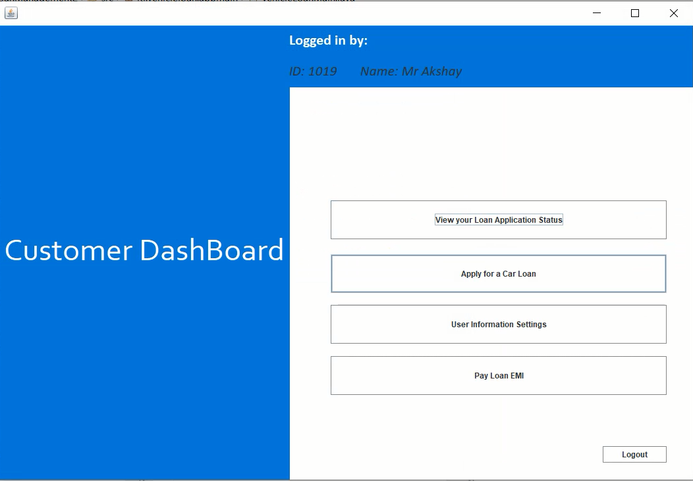
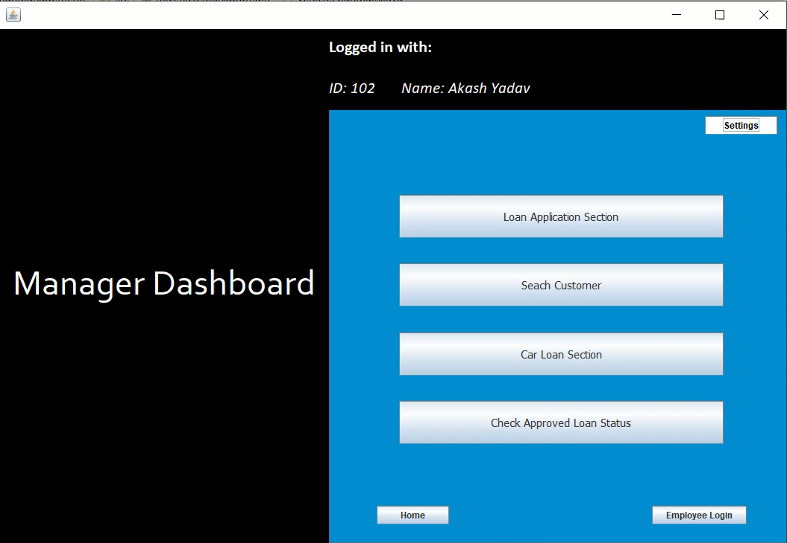
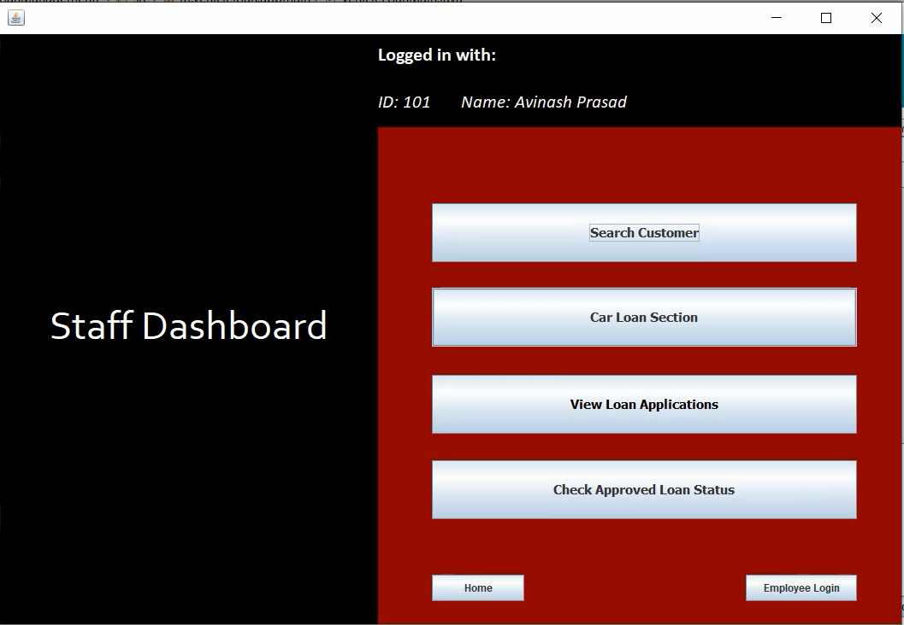

# Vehicle-Loan-Management-System

My first project on creating a common Vehicle Loan Management Application for both Customers and Bank Employees with functions as below:

***As a Customer***:

1.	Home:
  The web homepage includes the login of user, if customer is not registered then user will register first and the login into the website. Without login they can only access the   basic information. 
2.	Customer-Registration:
  If customer is new to website then user can register himself/herself and provide the necessary basic information. If customer do not have any bank account then too customer  can register.
3.	Customer-Login:
  In Login page user will enter the login id and password to get the access to Customer Dashboard where he/she will be able to apply for the loan of his choice.
4.	Customer Dashboard:
  With successful login of the customer, he/she will have access to his/her own customer dashboard which provides multiple functions and setting pages which user can go through.
5.	User Information Setting:
  Here the customer will provide all the necessary details required for Loan purpose such as Address, Bank details, PAN details, etc.
6.	Apply for loan:
  In this page user can see the different schemas for loan and according to his/her preference and car-type registered customer can apply for the loan. Also, without adding all    the customer information in the User information Settings, the user will not be to access further pages. It is mandatory for him/her to complete all the user details before      applying for a loan.
  Once the loan is applied, the application is sent to the Manager for approval.
7.	Loan Application Status
  The user after applying for loan can see his/her loan application status, whether it has been approved or not.
8.	Pay Loan EMI:
  Once the Loan application is approved by the Manager, the customer can now view his/her loan status along with a PayEMI option to pay EMI online.
  Also, once EMI is paid, the PayEMI button will not be functional for until a month.

***As a Bank Manager***:

1.	Loan Application Status window:
   In this window a Manager, can review loan applications along with the applicant details. He or She can also check if a particular loan application is eligible for loan or       not. Also, the manager can approve the loan application from here but not if the not loan application does not meet the eligibility.  
2.	Search Customer:
  This window provides the Manager a portal to search for a registered customer and view his/her full details.
3.	Check Approved Loan Status:
  Manager can view approved application’s loan status with EMI, Loan Term Left and many more.
4.	Car Loan Section:
  Here Manager can view current loans, add loans and update loans as required by the Bank and the market.

***As a Bank Employee***

1.	Loan Application Status window:
  In this window a Staff, can review loan applications along with the applicant details. He or She can also check if a particular loan application is eligible for loan or not.     But Staff has no authorization of Approving a Loan Application.
2.	Search Customer:
  This window provides the Staff a portal to search for a registered customer and view his/her full details.
3.	Check Approved Loan Status:
  Staff can view approved application’s loan status with EMI, Loan Term Left and many more.
4.	Car Loan Section:
  Here Staff can ONLY view current loans. (*But Staff has no authorization of Adding or Updating a Loan*).

Both Manager and Employee have same login page. The program automatically detects whether the user logged in is a Manager or an Employee.

*Additional Features*

* Tried my best to add Validations to all places possible.
* Certain Rule for the loan to be approved, hence Manager cannot approve loan applications which do not satisfy those rules.
* User should fill all the details such as Aadhar card details, PAN card details, address proof etc in order to apply for a Car Loan.

**Method used to calculate EMI**

E= P*R[ ((1+R)^n)/ (((1+R)^n)-1)]

* P: Principal Amount
* R: Rate of Interest per month
* n: Tenure of loan in months
* E: EMI

**Eligibility for Loan Application Approval**

1.	Applicant Details-
    *	DOB -> Age of the Customer should not be greater than 60.
2.	Price of Car and Loan Amount-
    *	The Loan amount chosen by customer should not exceed the Loan Constraint.
3.	Income Details-
    *	The Customer Annual salary should be more than the EMI for loan which he has opted for.

-----------------------------------------------------------------------------------------------------------------------------------------------------------------------------------

**Technologies used**:

* Back-end: Java 8
* Front-end: Java Swing 
* Database: Oracle 11g SQL Plus

**Pre-Requisites to run the application**:

* I worked on Eclipse 2020-06 version. An Eclipse IDE will be recommended.
* Oracle 11g SQL plus
* Java JDK 8 or above if released
* Jar files included in this project
* Make Databases as mentioned in DatabaseSetup.txt file.
